# Reddit Sentiment Classification — Results

3-class sentiment classification (negative / neutral / positive) on 37K+ Reddit
comments, benchmarking 7 models across three model families: traditional ML,
a PyTorch ANN, and three fine-tuned transformers.

## Summary

| Rank | Model | Accuracy | F1 (macro) | F1 (weighted) | Inference (s) |
|---|---|---|---|---|---|
| 1 | **BERT (bert-base-uncased)** | **0.9234** | **0.9235** | 0.9235 | 29.35 |
| 2 | DistilBERT (distilbert-base-uncased) | 0.9140 | 0.9140 | 0.9140 | 14.80 |
| 3 | RoBERTa (roberta-base) | 0.9028 | 0.9029 | 0.9029 | 26.62 |
| 4 | Linear SVM (TF-IDF) | 0.8513 | 0.8502 | 0.8502 | 0.13 |
| 5 | Logistic Regression (TF-IDF) | 0.8240 | 0.8231 | 0.8231 | 0.24 |
| 6 | Random Forest (TF-IDF) | 0.7847 | 0.7819 | 0.7819 | 0.75 |
| 7 | ANN / MLP (TF-IDF) | 0.7630 | 0.7625 | 0.7625 | 0.68 |

**Best model: BERT-base-uncased — 92.34% accuracy, 0.9235 macro-F1**, a **+7.2 point**
improvement over the strongest classical baseline (Linear SVM, 85.1%).

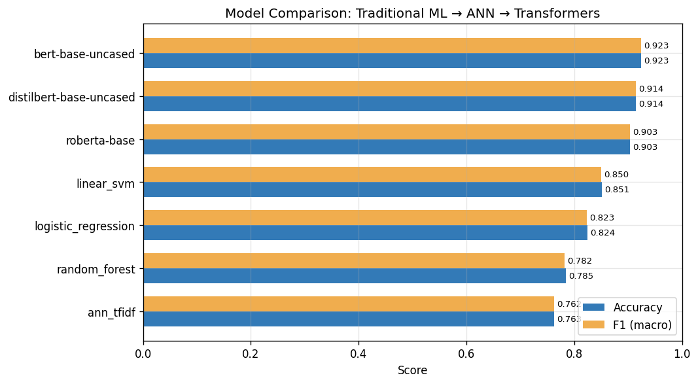

---

## Per-class metrics (top 3 models)

### BERT-base-uncased
| Class | Precision | Recall | F1 | Support |
|---|---|---|---|---|
| Negative | 0.898 | 0.911 | 0.904 | 1197 |
| Neutral | 0.956 | 0.939 | 0.947 | 1197 |
| Positive | 0.918 | 0.921 | 0.919 | 1197 |

### DistilBERT-base-uncased
| Class | Precision | Recall | F1 | Support |
|---|---|---|---|---|
| Negative | 0.888 | 0.903 | 0.896 | 1197 |
| Neutral | 0.946 | 0.936 | 0.941 | 1197 |
| Positive | 0.908 | 0.903 | 0.906 | 1197 |

### RoBERTa-base
| Class | Precision | Recall | F1 | Support |
|---|---|---|---|---|
| Negative | 0.876 | 0.876 | 0.876 | 1197 |
| Neutral | 0.941 | 0.926 | 0.934 | 1197 |
| Positive | 0.892 | 0.906 | 0.899 | 1197 |

Test set is perfectly balanced (1,197 samples/class) thanks to the
preprocessing pipeline's stratified split.

---

## Confusion matrices

### BERT-base-uncased (best model)


Errors are evenly spread with no dominant failure mode — the largest single
confusion is positive→negative (82 samples), consistent with sarcasm or
mixed-sentiment comments rather than a systematic model weakness.

### DistilBERT-base-uncased
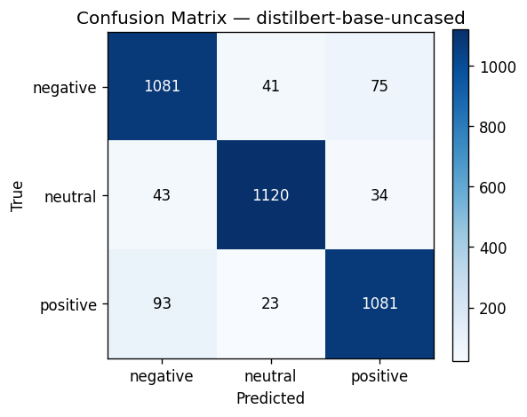

### RoBERTa-base
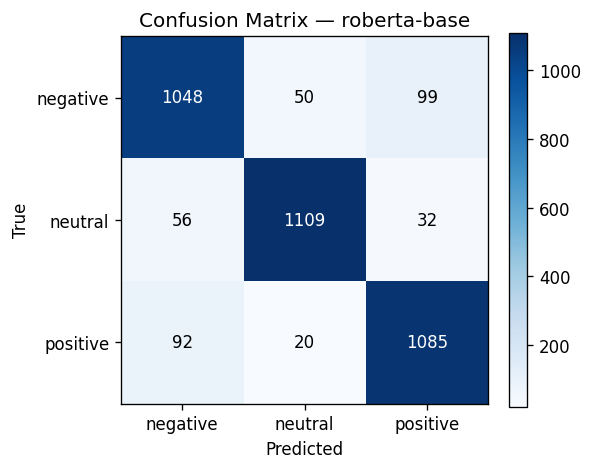

### Linear SVM
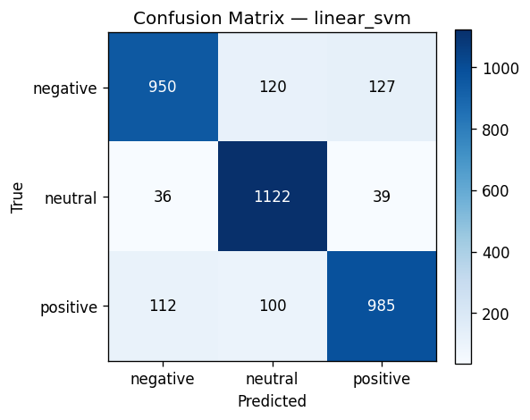

### Logistic Regression


### Random Forest
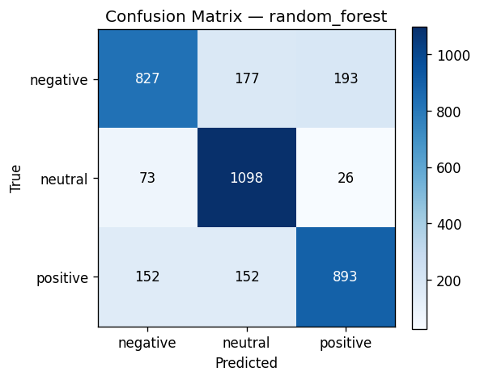

### ANN (TF-IDF + MLP)


---

## Training curves (loss-based models)

### BERT
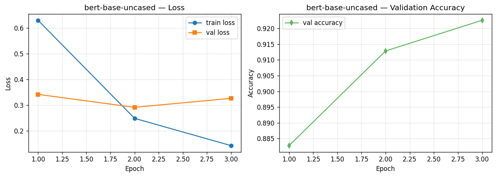

### DistilBERT
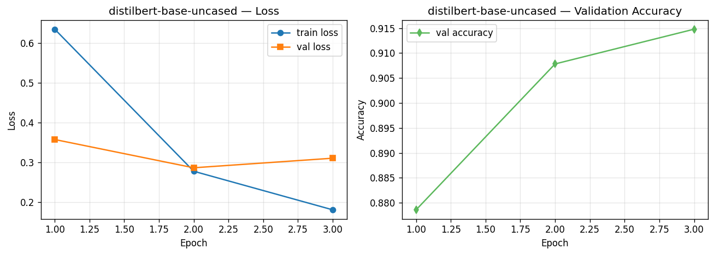

### RoBERTa
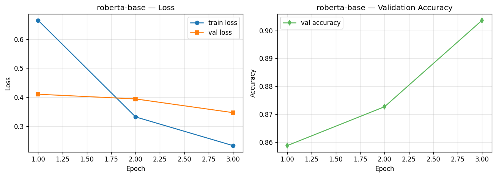

### ANN
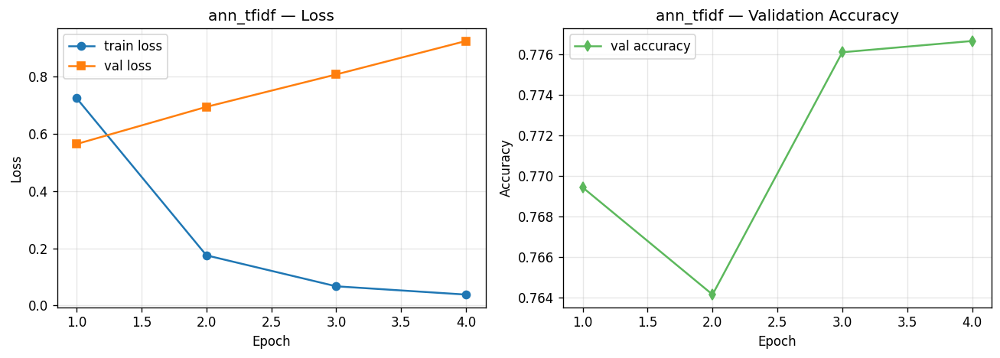

---

## Dataset

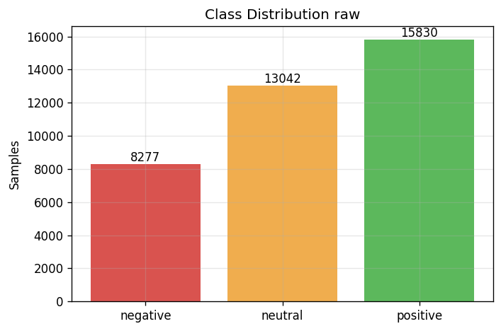
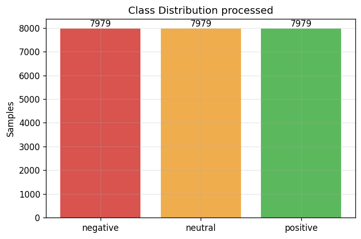
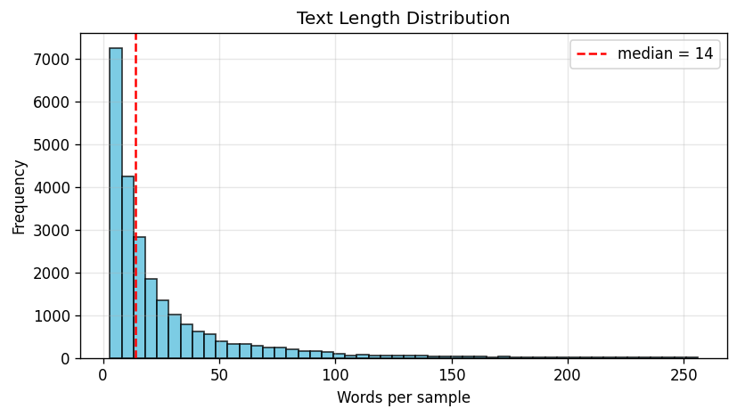

- **Size:** 37,249 labeled Reddit comments
- **Raw label split:** positive 15,830 · negative 13,142 · neutral 8,277
  (~1.9:1 imbalance, positive vs. negative)
- **Classes:** negative / neutral / positive, remapped from source labels
  {-1, 0, 1}
- **Split:** stratified 70% train / 15% val / 15% test (1,197 samples/class
  in the test set)

---

## Key findings

1. **Transformers beat classical ML by a wide margin** — all three
   transformer models outperform every TF-IDF-based model, with BERT
   leading by 7.2 points over the best classical baseline (Linear SVM).
   This gap reflects transformers' ability to capture context and word
   order (e.g. negation: "not good" vs. "good"), which bag-of-words
   TF-IDF features cannot represent.

2. **BERT > DistilBERT > RoBERTa on this dataset**, though the gaps are
   small (92.3% → 91.4% → 90.3%). DistilBERT reaches within 1 point of
   BERT at roughly **half the inference time** (14.8s vs. 29.4s),
   making it the better choice under latency constraints.

3. **Among classical models, Linear SVM > Logistic Regression > Random
   Forest**, consistent with the standard finding that linear models
   outperform tree ensembles on high-dimensional sparse TF-IDF features.

4. **The ANN (MLP on TF-IDF) underperforms even Random Forest.** Since
   it uses the same bag-of-words features as the classical models,
   this isolates the source of the transformer advantage: it's the
   **contextual embeddings**, not just "deep learning," that drive the
   accuracy gain — the ANN proves that a neural network alone, without
   better input representations, doesn't help.

5. **Neutral is the easiest class across every model**, not the hardest
   as is typical in sentiment literature — indicating this dataset's
   neutral-labeled comments are relatively unambiguous rather than
   borderline cases.

---

## Reproducing these results

```bash
pip install -r requirements.txt
python main.py --source premade
```

See the main [README.md](../README.md) for full setup, project structure,
and OOP design notes.
